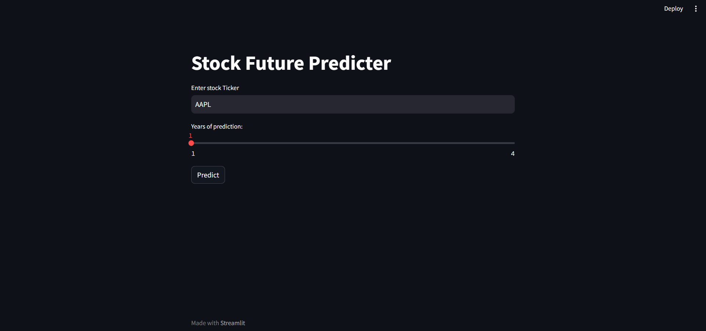

# Stock Future Predictor


## Overview

**Stock Future Predictor** is a web application built with Python, Streamlit, TensorFlow, and Facebook's Prophet model, designed to predict the future stock prices of various companies. The app allows users to input a stock ticker symbol, and it provides detailed predictions and visualizations based on historical data and advanced machine learning models.



## Features

- **User Input**: Input any stock ticker to fetch and analyze the historical stock data.
- **Data Visualization**: 
  - Closing Price vs. Time Chart
  - Moving Average Charts (100-day & 200-day)
- **Data Description**: Summarizes the statistical properties of the data from 2010 to the current date.
- **Machine Learning**:
  - Uses a pre-trained TensorFlow model to predict future stock prices.
  - Forecasting with Prophet to predict future trends for up to 4 years.
- **Interactive Charts**: Displays the forecast using interactive Plotly charts.
- **Comparison**: Visual comparison of predicted prices vs. original prices.

## Installation

To run this project locally, follow these steps:

1. **Clone the repository**:
   ```bash
   git clone https://github.com/your-username/stock-future-predictor.git

2. **Navigate to the project directory**:
   ```bash
   cd stock-future-predictor
   
3. **Install the required dependencies**:
   ```bash
   pip install -r requirements.txt
   
4. **Run the Streamlit app**:
   ```bash
   streamlit run Stockprediction.py

## Usage

- Upon launching the app, enter a stock ticker (e.g., AAPL) in the text input field.
- Use the slider to select the number of years for prediction.
- Click the "Predict" button to generate the forecast and visualizations.
- Explore the various charts, including moving averages and Prophet forecast plots.

## Dependencies

- Python 3.x
- Streamlit
- Numpy
- Pandas
- Matplotlib
- Pandas-Datareader
- YFinance
- TensorFlow
- Keras
- Scikit-learn
- Prophet
- Plotly

## Acknowledgments

- Streamlit for providing an easy way to build web applications.
- Facebook Prophet for time series forecasting.
- TensorFlow for powering the machine learning models.
- Yahoo Finance API for providing stock market data.

## Contributing

Feel free to submit issues or pull requests if you would like to contribute to the project.

## File Structure

```plaintext
stock-future-predictor/
│
├── app.py               # Main application script
├── model.h5             # Pre-trained TensorFlow model
├── README.md            # Project README
└── requirements.txt     # Python dependencies
